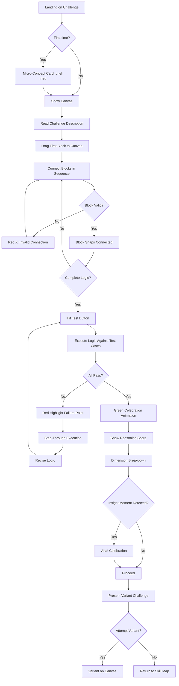
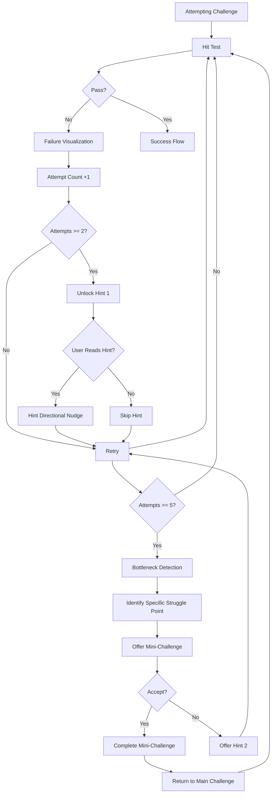
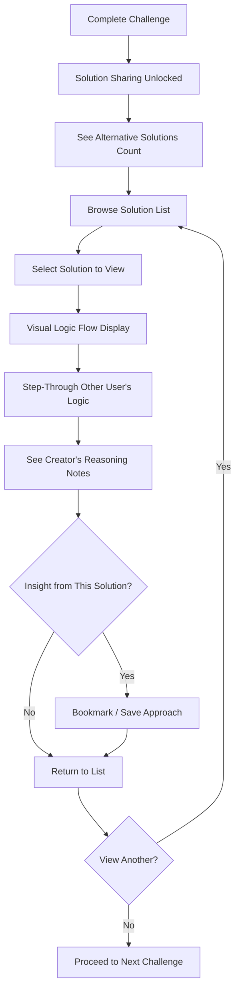

---
stepsCompleted:
  - 'Step 1: Workflow Initialization'
  - 'Step 2: Project Understanding'
  - 'Step 3: Core Experience'
  - 'Step 4: Emotional Response'
  - 'Step 5: UX Pattern Analysis & Inspiration'
  - 'Step 6: Design System Choice'
  - 'Step 7: Defining Experience'
  - 'Step 8: Visual Foundation'
  - 'Step 9: Design Directions'
  - 'Step 10: User Journey Flows'
  - 'Step 11: Component Strategy'
  - 'Step 12: UX Consistency Patterns'
  - 'Step 13: Responsive Design & Accessibility'
  - 'Step 14: Workflow Completion'
inputDocuments:
  - '/home/l2e/smirk/logiq/_bmad-output/planning-artifacts/prd.md'
  - '/home/l2e/smirk/logiq/_bmad-output/brainstorming/brainstorming-session-transcript-2026-04-13.md'
  - '/home/l2e/smirk/logiq/_bmad-output/brainstorming/brainstorming-session-2026-04-13-001.md'
documentCounts:
  briefCount: 0
  researchCount: 1
  brainstormingCount: 2
  projectDocsCount: 0
---

# UX Design Specification logiq

**Author:** 0x01
**Date:** 2026-04-14

---

## Executive Summary

### Project Vision

logiq is an interactive, visual, gamified web application that teaches developers logical reasoning and DSA problem-solving through a no-code, practice-first approach. The core philosophy is "Challenges ARE the curriculum. Failure IS the teacher." Users construct algorithmic thinking visually using drag-and-drop logic blocks — training the cognitive skills that transfer to any programming language. The platform differentiates from LeetCode, HackerRank, and Exercism through three pillars: no-code reasoning before syntax, multi-dimensional reasoning path scoring, and a systematic library of 11 physical visual metaphors that make abstract DSA concepts physically intuitive.

### Target Users

**Primary User:** Developers of all levels seeking to improve logical reasoning and DSA problem-solving skills. This includes beginners building foundational thinking, intermediate developers preparing for technical interviews, and experienced developers wanting to sharpen algorithmic intuition. No segmentation — the platform serves anyone who wants to "think like a developer" more effectively.

**Usage Context:** Desktop-primary (workstation deep-focus sessions), tablet support (iPad Safari for flexible learning), mobile-responsive for account management, progress viewing, and community features. Users engage in both extended problem-solving sessions (2+ challenges) and quick review visits (progress tracking, solution sharing).

**User Problem:** Existing platforms focus on syntax and binary pass/fail verdicts, providing no insight into *why* a solution failed or building genuine intuition for abstract concepts. Users want to understand reasoning, not just get answers right.

### Key Design Challenges

- **Complex Canvas Interaction:** The Logic Block Canvas must feel fluid and intuitive — drag-and-connect with snap physics, block validation, and real-time feedback on a complex visual workspace. This is the core interaction; getting it wrong kills the entire experience.
- **Making Reasoning Visible:** Four-dimensional reasoning scoring (problem breakdown, edge case proactivity, structure efficiency, iteration improvement) must be transparent and actionable — users need to understand their scores, not see a black box.
- **Failure as Teacher, Not Frustration:** The Failure Visualization Engine must show where and why logic broke in a diagnostic, emotionally supportive way. Step-through execution with red highlighting on failure points — tone matters deeply for learning retention.
- **Sequential Unlocking Without Confinement:** The Guided Linear Skill Path must balance "clear what's next" with motivational visibility of the full journey. Users shouldn't feel trapped but should always know their next step.

### Design Opportunities

- **Visual Metaphor Library as Competitive Moat:** 11 physical metaphors (arrays as sliding strips, linked lists as paper clips, recursion as nesting dolls, DP as construction) make abstract DSA concepts physically intuitive. No platform does this systematically — this is the most defensible UX differentiator and primary "wow" factor.
- **Insight-Driven Gamification:** Rewarding "insight streaks" and "aha! moments" instead of vanity metrics creates a fundamentally different emotional experience. The UX can make users visually see their own cognitive growth over time.
- **Post-Solve "Many Right Answers" Moment:** Solution sharing gated behind completion creates a powerful UX moment — users see their thinking reflected in others' approaches, discovering paths they never considered.
- **Prediction Gates for New Concepts:** Active prediction before showing algorithm execution creates the "oh, I was wrong" moment where genuine learning occurs. Research-backed, rare in practice.

---

## Core User Experience

### Defining Experience

The core user experience of logiq is **attempting challenges on the Logic Block Canvas** — the single most frequent and critical interaction. Users drag and connect visual logic blocks (loops, conditions, comparisons, edge case handlers) to construct algorithm solutions, then test them against challenge requirements. This is the heart of the product: if this interaction feels fluid, intuitive, and productive, everything else follows.

The experience loop is: **Read challenge → Drag blocks → Connect logic → Test → See feedback (pass/failure visualization) → Iterate → Complete → See reasoning score → Unlock next challenge.** This loop must feel like a puzzle game, not a coding platform — engaging, productive, and genuinely educational.

### Platform Strategy

| Aspect | Decision |
|--------|----------|
| **Primary Platform** | Web application (desktop-first, browser-based) |
| **Browser Support** | Chrome, Firefox, Safari, Edge (latest 2 versions) |
| **Tablet Support** | iPad Safari — touch-optimized canvas interactions |
| **Mobile Support** | Responsive for account management, progress viewing, community features — NOT core canvas interaction |
| **Input Method** | Mouse/keyboard primary, touch support for tablet |
| **Offline Support** | Local storage for draft work on challenges; server-synced progress for account continuity |
| **Technology** | HTML5 Canvas or SVG for drag-and-drop logic blocks; WebGL for complex algorithm visualizations |

### Effortless Interactions

The following interactions must feel completely natural and require zero thought:

- **Block Dragging & Snapping:** Dragging blocks onto the canvas and connecting them should feel like physical puzzle pieces — snap-to-connect with satisfying physics, instant visual feedback, no lag (<100ms response).
- **Challenge Comprehension:** Challenge descriptions should be concise, scannable, and visually clear — no intimidating walls of text like LeetCode. Users should understand what they need to build within seconds.
- **Test Execution Feedback:** Hitting "Test" should immediately show results. Success paths light up green; failure points light up red with step-through execution. No waiting, no confusion.
- **Reasoning Score Visualization:** Scores should be immediately understandable — a glance at the dashboard tells users how they're doing across 4 dimensions, with drill-down available.
- **Progression Navigation:** "What's next?" should always be obvious — the current challenge is highlighted, the next one is visible (locked), and the full skill map territory is in view.

### Critical Success Moments

| Moment | Description | UX Implication |
|--------|-------------|----------------|
| **First Challenge Completion** | User completes their first challenge and sees their reasoning score for the first time | Must feel like a genuine accomplishment — celebration, clear score breakdown, immediate "what's next" |
| **First "Aha!" Moment** | User revises their approach after failure and sees dramatic improvement | Platform detects and celebrates this breakthrough visually — the core emotional hook |
| **First Failure Visualization** | User sees exactly where their logic broke, not just "incorrect" | Must be diagnostic, not discouraging — red highlighting with step-through, "80% of devs make this mistake" normalization |
| **First Variant Completion** | User adapts their solution to a variant challenge | Reinforces generalization — "you didn't just memorize, you understood" |
| **First Solution Share Unlock** | After completing a challenge, user sees how others solved it | "There are many right answers" moment — discovery of approaches they never considered |

### Experience Principles

1. **Practice-First, No Decoration:** Challenges drive everything. No videos, no long articles, no vanity metrics. Every UI element must serve the learning loop.
2. **Failure is the Teacher:** Every wrong attempt must be diagnostic and productive. Red-highlighted failure paths with step-through execution, not binary pass/fail.
3. **Visual Intuition Over Abstraction:** Abstract DSA concepts become physically intuitive through visual metaphors. The visualization IS the explanation.
4. **Transparent Scoring:** Users must understand why they scored what they did. Multi-dimensional scoring with visible rubrics, specific feedback per dimension.
5. **Guided Progression:** Always know what's next. See the full territory ahead, but only 1-3 challenges unlocked at a time — no decision paralysis.
6. **Gamification Serves Learning:** Reward insight streaks (productive failure recovery), not login streaks. Reward reasoning trajectory, not just correctness.
7. **Desktop-First, Touch-Graceful:** Core canvas interaction is desktop-primary with satisfying mouse/keyboard feel. Tablet touch interactions must feel equally fluid.

---

## Desired Emotional Response

### Primary Emotional Goals

| Emotional Goal | Description | UX Design Approach |
|----------------|-------------|-------------------|
| **Empowered & Growing** | Users feel their cognitive ability expanding — "I can actually think like this now" | Visible skill progression maps, reasoning score growth charts, insight streak counters |
| **Curious & Engaged** | Users want to see "what happens next" — the next challenge, the next variant, the next insight | Sequential challenge unlocking, variant delivery, "what would happen if..." prompts |
| **Productively Challenged** | Users are in the "tear but don't break" zone — struggling but not frustrated | Calibrated difficulty, hint gating after attempts, bottleneck detection with mini-challenges |
| **Validated & Understood** | Users feel the platform "gets" their thinking process — not just judging output | Transparent reasoning scoring, dimension-specific feedback, "80% of devs make this mistake" |

### Emotional Journey Mapping

| Stage | Desired Emotion | UX Design Support |
|-------|----------------|-------------------|
| **Discovery (Landing)** | Intrigued, skeptical-but-interested | Clear differentiation from LeetCode — "no-code reasoning," visual canvas preview, "think before you type" messaging |
| **Onboarding (First Challenge)** | Slightly anxious → immediately capable | Simple first challenge (linear search), clear block vocabulary introduction, immediate positive feedback |
| **Core Loop (Attempting)** | Focused, in flow, productively challenged | Fluid canvas interaction, instant feedback, progressive difficulty that stays in the zone |
| **Failure Moments** | "Oh, I see why" — not "I'm dumb" | Red-highlighted failure paths with step-through execution, common mistake normalization, targeted hints |
| **Success Moments** | "Aha! I get it!" — genuine insight | Aha! moment celebration, reasoning score breakdown, insight streak growth, "what's next" clarity |
| **Post-Solve (Solution Sharing)** | "Wow, I never thought of that" | Alternative approaches with creator reasoning annotations, "many right answers" framing |
| **Return Visit** | "Let me keep building this skill" | Progress visibility, insight streak continuity, clear next challenge waiting |

### Micro-Emotions

| Tension | Desired State | UX Support |
|---------|--------------|------------|
| Confidence vs. Confusion | **Confident in direction, curious about gaps** | Clear challenge descriptions, visible skill prerequisites, immediate failure diagnosis |
| Trust vs. Skepticism | **Trust in scoring validity** | Transparent rubrics, expert correlation claims, "why this score" explanations |
| Excitement vs. Anxiety | **Excited about challenge, not anxious about failure** | Calibrated difficulty, productive failure framing, "failure is the teacher" messaging |
| Accomplishment vs. Frustration | **Accomplished through iteration** | Insight streaks over login streaks, iteration improvement scoring, bottleneck detection |
| Delight vs. Satisfaction | **Delighted by visual metaphors** | 11 physical metaphors that make abstract concepts "click" — the primary wow factor |
| Belonging vs. Isolation | **Part of a learning community (optional)** | Friend activity feed, micro-leaderboards, post-solve solution sharing |

### Emotional Design Principles

1. **Celebrate the Journey, Not Just the Destination:** Insight streaks, aha! moments, iteration improvement — all reward the path, not just the outcome.
2. **Make Failure Visible and Normal:** Red-highlighted failure paths + "80% of developers make this mistake" = failure becomes social learning, not personal shame.
3. **Growth Must Be Visible:** Reasoning score charts, skill map progression, insight moments timeline — users must SEE their cognitive growth.
4. **Tension, Not Stress:** Difficulty should create productive struggle (the "muscle micro-tear" before growth), not overwhelming frustration.

---

## UX Pattern Analysis & Inspiration

### Inspiring Products Analysis

| Product | What It Does Well | Transferable Insight |
|---------|------------------|---------------------|
| **Baba Is You** | Puzzle game where rules are the gameplay — players manipulate logic to solve problems | Visual logic manipulation as gameplay; "rules you construct" not "rules you follow" |
| **Human Resource Machine** | Visual programming puzzle game — drag-and-drop commands to solve office tasks | Visual programming can be fun and engaging; progressive difficulty through visual puzzles |
| **LeetCode** | Massive problem library, clear problem statements, community solutions | Clear problem statement format; community solution browsing (but with our reasoning twist) |
| **Duolingo** | Gamified learning with streaks, progress visualization, micro-lessons | Insight streaks (not login streaks); visible skill trees; bite-sized progression |
| **Figma** | Fluid, real-time collaborative canvas — drag, connect, see changes instantly | Canvas interaction fluidity; real-time collaboration feel; snap-to-grid satisfaction |
| **Notion** | Block-based content construction — drag, nest, connect blocks intuitively | Block-based UI as familiar pattern; drag-and-connect mental model already established |

### Transferable UX Patterns

**Navigation Patterns:**

- **Guided Linear Path with Visible Territory** (from Duolingo skill tree + our constraint) — full map visible, sequential unlocking, always know "what's next"
- **Side Panel Context Navigation** (from Figma) — challenge description in left panel, canvas in center, reasoning scores in right panel

**Interaction Patterns:**

- **Drag-and-Connect Blocks** (from Human Resource Machine + Notion) — familiar block paradigm, snap physics, connection validation
- **Step-Through Execution** (from debugger UX) — animated algorithm visualization with play/pause/step controls
- **Prediction Gates** (from interactive video learning) — pause execution, ask "what happens next?", reveal gap between expectation and reality

**Visual Patterns:**

- **Color-Coded Feedback** (universal) — green for success paths, red for failure points, amber for warnings/edge cases
- **Progress Visualization** (from Duolingo) — skill map as explorable territory, progress markers, locked/unlocked states
- **Physical Metaphors** (unique to logiq) — arrays as sliding strips, linked lists as paper clips, recursion as nesting dolls

### Anti-Patterns to Avoid

- **LeetCode's Intimidating Problem Statements:** Walls of text, abstract examples, no visual orientation → **Our fix:** concise, scannable challenge descriptions with visual examples
- **Binary Pass/Fail Feedback:** "Wrong answer" with no explanation → **Our fix:** step-through failure visualization with red-highlighted broken paths
- **Global Leaderboards:** Toxic competition, discouragement for beginners → **Our fix:** micro-leaderboards among friends, growth metrics over raw scores
- **Login Streak Gamification:** Mindless checking in, no learning value → **Our fix:** insight streaks rewarding productive failure recovery
- **Video-Heavy LMS:** Passive consumption, low engagement → **Our fix:** challenges-first, micro-concept cards only (3-4 sentences + visual)
- **Overwhelming Choice in Curriculum:** Decision paralysis, skipping critical foundations → **Our fix:** sequential unlocking, 1-3 challenges at a time

### Design Inspiration Strategy

**What to Adopt:**
- Block-based UI familiarity (Notion, Human Resource Machine) — reduces learning curve
- Skill tree visualization (Duolingo) — clear progression, visible territory
- Fluid canvas interaction (Figma) — snap physics, instant feedback

**What to Adapt:**
- Gamification from Duolingo — but reward insight streaks, not login streaks
- Community solutions from LeetCode — but gate behind completion, annotate with reasoning

**What to Avoid:**
- Syntax-focused challenges (LeetCode, HackerRank) — we teach reasoning before syntax
- Content-heavy LMS (Coursera, Udemy) — challenges ARE the curriculum

---

## Design System Foundation

### Design System Choice

**Selected Approach:** Themeable System (Tailwind UI / shadcn/ui)

**Rationale:**
- logiq requires significant custom components (Logic Block Canvas, visual metaphors, reasoning score visualization) that go beyond any standard design system
- Tailwind provides utility-first flexibility for building custom canvas interactions and unique visual patterns
- shadcn/ui provides accessible, well-documented base components (buttons, cards, dialogs, navigation) for the surrounding UI
- Best balance of development speed and visual uniqueness — we get proven accessibility patterns while maintaining complete freedom for custom canvas and metaphor designs
- Strong community support, excellent documentation, and easy customization through CSS variables/design tokens

### Implementation Approach

| Aspect | Decision |
|--------|----------|
| **CSS Framework** | Tailwind CSS — utility-first, design token system, easy customization |
| **Component Library** | shadcn/ui — accessible base components (buttons, dialogs, cards, dropdowns, tooltips) |
| **Canvas Technology** | HTML5 Canvas + Konva.js or React Flow for Logic Block Canvas drag-and-connect |
| **Animation Library** | Framer Motion for UI transitions; custom WebGL/Canvas for algorithm visualizations |
| **Design Tokens** | CSS custom properties (variables) for colors, spacing, typography — enables easy theming |
| **Icon Set** | Lucide Icons — clean, consistent, matches modern developer tool aesthetic |

### Customization Strategy

**Custom Components Required (beyond shadcn/ui):**
- Logic Block Canvas (primary interaction)
- Visual Metaphor Displays (11 unique metaphors)
- Reasoning Score Dashboard (4-dimensional scoring visualization)
- Skill Map (explorable territory visualization)
- Failure Visualization Engine (step-through execution)
- Insight Streak Tracker / Aha! Moment Timeline
- Progress Variant Cards

**Theming Approach:**
- Design tokens defined in CSS custom properties
- Tailwind configured with token values
- Custom components use tokens for consistency
- Base shadcn/ui components themed to match

---

## Core User Experience

### 2.1 Defining Experience

**The Defining Interaction: Logic Block Canvas — Build, Test, Iterate**

Every successful product has a defining interaction. For logiq, it's the Logic Block Canvas: users drag and connect visual logic blocks to construct algorithm solutions, test them, see feedback, and iterate. This is the interaction users will describe to friends: "You build algorithms by dragging blocks — no code, just pure logic."

If we nail this interaction — fluid dragging, satisfying snap-to-connect, instant test feedback, clear iteration path — everything else follows. The canvas is where learning happens, where reasoning is scored, where failure becomes the teacher.

### 2.2 User Mental Model

**Current Mental Model (from LeetCode/HackerRank users):**
- "I read a problem → I write code → I submit → I get pass/fail → if fail, I guess what's wrong"
- Users expect to type code, use their IDE muscle memory, see test results as text
- They bring the mental model of "submit → wait → verdict"

**Target Mental Model (for logiq):**
- "I read a challenge → I build my logic with blocks → I test → I see exactly where it broke → I fix it → I understand why"
- Users should think of the canvas as a puzzle workspace, not a code editor
- The metaphor is "building a flowchart that actually runs" — visual, constructive, iterative

**Transition Strategy:**
- Onboarding introduces blocks as "thinking tools" not "code replacements"
- First challenge is trivially simple (linear search) to establish the interaction pattern
- Visual metaphors bridge abstract concepts to physical intuition

### 2.3 Success Criteria

| Success Indicator | User Feeling | UX Support |
|-------------------|-------------|------------|
| "This just works" | Fluid, no friction in block building | <100ms snap response, intuitive block placement, connection validation |
| "I'm smart" | Insight moment after revision | Aha! detection and celebration, reasoning score improvement visible |
| "I know I'm doing it right" | Progressive confidence during building | Real-time block validation (can't connect incompatible blocks), preview of logic flow |
| "It's fast" | Instant feedback | Test execution feels immediate, animations at 60fps, no loading states during core loop |
| "It handles my mistakes" | Not punished for being wrong | Step-through failure visualization, common mistake normalization, hint gating |

### 2.4 Novel vs. Established Patterns

**Established Patterns (users already understand):**
- Drag-and-drop (Notion, Figma, Trello) — familiar interaction model
- Block-based programming (Scratch, Human Resource Machine) — visual logic construction
- Step-through debugging (IDE debuggers) — execution visualization

**Novel Patterns (need user education):**
- **Reasoning Path Scoring** — no platform scores the process, only the output. Need visible rubrics and "why this score" explanations.
- **Visual Metaphor Library** — 11 physical metaphors for DSA concepts is unique. Need clear introduction and consistent visual language.
- **Prediction Gates** — pause execution and ask "what happens next?" before revealing. Need clear framing as a learning tool, not a test.

**Strategy:** Wrap novel patterns in familiar interactions. The canvas feels like Figma, the blocks feel like Notion, the progression feels like Duolingo — but the learning model is entirely new.

### 2.5 Experience Mechanics

**Core Loop: Challenge Attempt Flow**

1. **Initiation:** User lands on current challenge. Left panel shows challenge description (concise, with visual example). Center is empty canvas. Right panel shows available logic blocks organized by category. "What's next" shows current challenge highlighted, next challenge locked.

2. **Interaction:** User reads challenge → drags first block from right panel to canvas → connects subsequent blocks → canvas validates connections in real-time (incompatible connections show red X) → user hits "Test" button.

3. **Feedback:** Platform runs logic against test cases → success paths light up green → failure points light up red with step-through execution → reasoning score appears (4 dimensions) → specific feedback per dimension.

4. **Iteration/Completion:** If fail: user sees where logic broke, revises blocks, retests. If pass: platform celebrates → shows reasoning score breakdown → presents variant challenge → user can attempt variant or proceed to next challenge on skill map.

---

## Visual Design Foundation

### Color System

**Palette Strategy:** Dark-mode-first design (developer tool aesthetic) with vibrant accent colors for feedback and visual metaphors.

**Semantic Color Mapping:**

| Semantic Role | Color | Usage |
|--------------|-------|-------|
| **Primary** | Indigo (#6366F1) | Primary actions, active states, skill map path |
| **Success** | Emerald (#10B981) | Passing test cases, completed challenges, success paths |
| **Error/Failure** | Rose (#F43F5E) | Failed test cases, broken logic paths, error states |
| **Warning** | Amber (#F59E0B) | Edge case warnings, hint notifications, attention states |
| **Info** | Sky (#0EA5E9) | Information panels, block categories, tooltip highlights |
| **Insight/Aha!** | Violet (#8B5CF6) | Insight moments, aha! celebrations, breakthrough tracking |
| **Neutral Background** | Slate (#0F172A / #1E293B) | Dark backgrounds, canvas surface, card surfaces |
| **Neutral Text** | Slate (#F8FAFC / #94A3B8) | Primary text, secondary text, labels |

**Accessibility:** All color combinations meet WCAG 2.1 AA contrast ratios (4.5:1 for normal text, 3:0 for large text).

### Typography System

**Primary Typeface:** Inter — modern, highly legible sans-serif designed for screens. Works well for both UI elements and reading content.

**Secondary Typeface (for visual metaphors and code-like elements):** JetBrains Mono — monospace for any code-adjacent content, block labels, and algorithm visualization annotations.

**Type Scale:**

| Level | Size | Weight | Usage |
|-------|------|--------|-------|
| H1 | 2.5rem (40px) | 700 | Page titles, challenge titles |
| H2 | 2rem (32px) | 600 | Section headers, skill cluster titles |
| H3 | 1.5rem (24px) | 600 | Subsection headers, panel titles |
| H4 | 1.25rem (20px) | 600 | Card titles, block category headers |
| Body | 1rem (16px) | 400 | Body text, challenge descriptions |
| Small | 0.875rem (14px) | 400 | Labels, hints, secondary text |
| Tiny | 0.75rem (12px) | 400 | Block labels, metadata, timestamps |
| Mono | 0.875rem (14px) | 400 | Code-like elements, block IDs, algorithm annotations |

**Line Heights:** 1.5 for body text, 1.3 for headings, 1.6 for challenge descriptions (readability focus).

### Spacing & Layout Foundation

**Spacing System:** 8px base unit with a consistent scale: 4, 8, 12, 16, 24, 32, 48, 64, 96px.

**Layout Approach:**
- **Desktop:** 3-panel layout — left panel (challenge description, 280px), center canvas (flexible), right panel (blocks & scoring, 300px)
- **Tablet:** 2-panel with collapsible side — canvas full-width, panels as overlays
- **Mobile:** Single panel with tabbed navigation — canvas, description, blocks as separate tabs

**Grid System:** CSS Grid for page layout, Flexbox for component internals. Canvas uses absolute positioning for block placement.

**White Space:** Generous spacing around the canvas area (breathing room for focus), tighter spacing in panels (information density). Panel padding: 16px, gap between elements: 12px.

---

## Design Direction Decision

### Design Directions Explored

Based on the visual foundation, the design direction for logiq is: **"Puzzle Workshop"** — a dark-mode, canvas-centered workspace where the challenge canvas dominates the viewport, surrounded by supportive panels. The aesthetic is clean, modern developer-tool meets puzzle game — think VS Code's layout sensibility meets Human Resource Machine's visual playfulness.

### Chosen Direction

**Key Characteristics:**
- **Canvas-Centered:** The Logic Block Canvas occupies the majority of the viewport — it IS the product
- **Dark Workshop Aesthetic:** Dark slate backgrounds (#0F172A) with subtle grid lines on the canvas, creating a focused "workshop" feel
- **Vibrant Feedback:** Bright, saturated colors for success (emerald green), failure (rose red), and insight (violet purple) against the dark background — feedback is impossible to miss
- **Playful but Professional:** Visual metaphors add warmth and playfulness (paper clips, nesting dolls, sliding strips) but the overall UI remains clean and professional
- **Information Hierarchy:** Challenge description (left) → Canvas (center) → Tools & Scores (right) — natural left-to-right workflow

### Design Rationale

1. **Canvas dominance** reinforces that building IS the product — no sidebars competing for attention
2. **Dark mode** reduces eye strain during long focus sessions, matches developer tool expectations
3. **Vibrant feedback colors** create immediate emotional signal — green = good, red = fix this, purple = breakthrough
4. **Visual metaphors** differentiate from every coding platform — they're the "wow" factor that makes abstract concepts physical

### Implementation Approach

- Build responsive 3-panel layout with CSS Grid
- Canvas rendered with HTML5 Canvas or React Flow library
- Panels use shadcn/ui Card, ScrollArea, and Accordion components
- Visual metaphors implemented as SVG illustrations with CSS animations
- Framer Motion for panel transitions, insight celebrations, and score animations

---

## User Journey Flows

### Journey 1: The Reasoning Breakthrough (Success Path)

**Goal:** User completes their first challenge, experiences an "aha!" moment, and proceeds to the next challenge.

**Flow Optimization:**
- Minimize cognitive load: challenge description is concise, block vocabulary is organized by category
- Real-time validation: can't connect incompatible blocks, reducing frustration
- Immediate feedback: <100ms snap response, instant test execution
- Clear progression: always know "what's next" — variant or next challenge

### Journey 2: The Productive Failure (Struggle & Recovery)

**Goal:** User fails repeatedly, receives targeted support, and eventually succeeds through productive struggle.

**Flow Optimization:**
- Hints gated (unlock after 2-3 attempts) — preserves productive struggle
- Bottleneck detection (5+ failures) — prevents frustration spiral
- Mini-challenges target specific sub-skills — surgical remediation
- Tone throughout: "this is hard, you're learning" not "you're failing"

### Journey 3: Post-Solve Solution Sharing

**Goal:** After completing a challenge, user discovers alternative approaches and gains new perspectives.

**Flow Optimization:**
- Gated behind completion — user has their own solution to compare against
- Creator annotations add reasoning context — not just "what" but "why"
- Bookmarking saves approaches for future reference
- "Many right answers" framing throughout

### Journey Patterns

**Reusable Patterns Across Journeys:**

| Pattern | Usage | Consistency Benefit |
|---------|-------|---------------------|
| **Challenge Entry** | All challenge journeys start here | Consistent onboarding, reduced cognitive load |
| **Canvas Interaction** | Block drag, connect, test, iterate | Familiar interaction across all challenges |
| **Test Feedback** | Green/red path highlighting | Consistent success/failure signals |
| **Reasoning Score Display** | Post-completion scoring | Users learn to read and improve their scores |
| **Variant Presentation** | Post-completion next step | Always know "what's next" |
| **Hint Gating** | Unlock after attempts | Consistent productive struggle model |

### Flow Optimization Principles

1. **Minimize Steps to Value:** Every interaction between reading the challenge and getting feedback should be frictionless — no unnecessary clicks, no loading states during core loop.
2. **Reduce Cognitive Load at Decisions:** Block categories are organized, challenge descriptions are scannable, scoring dimensions are labeled — users never wonder "what does this mean?"
3. **Clear Progress Indicators:** Attempt count visible, hint unlock status clear, reasoning score updating in real-time — users always know where they stand.
4. **Delight at Accomplishment:** Green celebration animations, aha! moment detection, insight streak growth — success feels earned and celebrated.
5. **Graceful Error Recovery:** Every failure path has a recovery — revise logic, read hint, try mini-challenge — users never feel stuck.

---

## Component Strategy

### Design System Components (from shadcn/ui)

| Component | Usage in logiq |
|-----------|----------------|
| **Button** | Primary/secondary actions throughout (Test, Submit, Next, Hint) |
| **Card** | Challenge description panels, solution cards, micro-concept cards |
| **Dialog/Modal** | Challenge intro, aha! celebrations, bottleneck interventions |
| **Tooltip** | Block descriptions, scoring dimension explanations |
| **Accordion** | Collapsible hint sections, scoring dimension breakdowns |
| **Badge** | Challenge status (locked, current, completed), insight streaks |
| **Progress** | Skill cluster progress bars, challenge completion indicators |
| **Tabs** | Mobile navigation, panel switching on tablet |
| **ScrollArea** | Block lists, solution lists, long challenge descriptions |
| **Separator** | Visual dividers between panels, sections |
| **Toast** | Transient notifications (variant unlocked, insight moment) |
| **Avatar** | User profiles, friend activity feed |

### Custom Components

#### Logic Block Canvas

**Purpose:** Core interaction — users drag and connect visual logic blocks to construct algorithm solutions.

**Anatomy:**
- Canvas surface (dark background with subtle grid lines)
- Block palette (right panel, categorized blocks)
- Connected block flow (center, user-built logic)
- Connection lines (curved paths between blocks)
- Test button (floating action)
- Validation indicators (green checkmarks, red X on invalid connections)

**States:** Empty (welcome prompt), Building (blocks being placed), Testing (execution animation — green/red paths), Complete (celebration + score), Failed (red failure paths with step-through).

**Variants:** Desktop (full canvas), Tablet (full-width canvas), Mobile (tabbed view).

**Accessibility:** Full keyboard navigation (Tab between blocks, Enter to place, Arrow keys to connect), ARIA labels on all blocks, screen reader announces logic flow structure.

**Interaction Behavior:** Drag from palette → drop on canvas → drag connection point to connection point → snap animation → validation feedback.

#### Visual Metaphor Display

**Purpose:** Present 11 physical metaphors that make abstract DSA concepts intuitively graspable.

**Metaphors:**
1. Array → Horizontal sliding strip
2. Linked List → Chain of paper clips
3. Stack → Pile of plates
4. Queue → Conveyor belt
5. Tree → Living organism (branching)
6. Graph → City map (intersections + roads)
7. Hash Map → Filing cabinet
8. Binary Search → Book-closing ritual
9. Recursion → Russian nesting dolls
10. Dynamic Programming → Construction site
11. Two Pointers → Converging scissors

**States:** Static (concept introduction), Animated (algorithm execution), Interactive (user manipulates metaphor).

#### Reasoning Score Dashboard

**Purpose:** Display 4-dimensional reasoning scores with transparent rubrics.

**Dimensions:** Problem Breakdown, Edge Case Proactivity, Structure Efficiency, Iteration Improvement.

**Anatomy:** Score overview (4 gauge meters or radar chart), dimension breakdown (expandable cards with scores and feedback), improvement suggestions per dimension.

**States:** Pre-test (no score), Post-test (scores displayed), Post-iteration (scores with improvement delta).

#### Skill Map

**Purpose:** Visual territory map showing full skill path, with sequential unlocking.

**Anatomy:** Map canvas (visual territory with paths/nodes), challenge nodes (locked/current/completed/mastered), current position indicator, next challenge highlight.

**States:** Browsing (full map visible), Current challenge focused, Locked nodes (grayed, tooltip shows prerequisite), Completed nodes (green with mastery rating).

#### Failure Visualization Engine

**Purpose:** Show exactly where and why logic broke with step-through execution.

**Anatomy:** Step-through player (play/pause/step controls), logic flow with red-highlighted failure path, error description panel, common mistake context ("80% of devs make this mistake here").

**States:** Playing (auto step-through), Paused (user examining), At failure point (red highlight + explanation), Complete (full path shown).

#### Insight Streak Tracker

**Purpose:** Track and display consecutive insight moments (productive failure recoveries).

**Anatomy:** Streak counter (prominent display), insight moment timeline (visual history), growth chart (reasoning score over time).

### Component Implementation Strategy

| Phase | Components | Priority Rationale |
|-------|-----------|-------------------|
| **Phase 1 (Core)** | Logic Block Canvas, Test Feedback Display, Reasoning Score Dashboard, Skill Map | Required for MVP core journeys (Reasoning Breakthrough, Productive Failure) |
| **Phase 2 (Supporting)** | Visual Metaphor Displays, Failure Visualization Engine, Insight Streak Tracker, Hint Gating, Bottleneck Detection UI | Enhance learning experience, support struggle & recovery journey |
| **Phase 3 (Enhancement)** | Solution Sharing Viewer, Friend Activity Feed, Challenge Design Mode UI, Prediction Gate UI, Micro-Concept Cards | Growth features, community features, advanced learning patterns |

---

## UX Consistency Patterns

### Button Hierarchy

| Level | Style | Usage |
|-------|-------|-------|
| **Primary** | Filled indigo background, white text | Test, Submit, Next Challenge, Accept Mini-Challenge |
| **Secondary** | Outlined indigo border, indigo text | Retry, View Solution, Read Hint, Browse Skill Map |
| **Tertiary** | Text link, indigo color | Explain Your Thinking, Compare Solutions, Design Challenge |
| **Danger** | Filled rose background, white text | Reset Canvas, Delete Challenge (admin) |
| **Disabled** | Gray background, low opacity | Locked challenges, unmet prerequisites |

**Rules:** One primary action per screen state. Primary = next step in journey. Secondary = alternative path. Never more than 2 primary actions visible simultaneously.

### Feedback Patterns

| Type | Visual | Usage |
|------|--------|-------|
| **Success** | Emerald green checkmark + subtle glow animation | Test case passed, challenge completed, hint unlocked |
| **Error** | Rose red X + shake animation on failure point | Invalid block connection, test case failed, edge case break |
| **Warning** | Amber triangle + pulse animation | Approaching attempt limit for hint, edge case about to fail |
| **Info** | Sky blue circle + static display | Block description, scoring explanation, challenge hint |
| **Insight** | Violet sparkle + celebration animation | Aha! moment detected, reasoning score improved, streak grew |

**Toast Notifications:** Appear top-right, auto-dismiss after 4s (success/info), require dismissal for warnings. Insight celebrations are modal-level (require acknowledgment).

### Form Patterns

**Canvas "Forms" (Logic Block Construction):**
- No traditional forms — the canvas IS the input mechanism
- Block connections are the "form fields" — validation happens in real-time
- "Submit" = Hit Test button
- "Validation errors" = Red X on invalid connections, failure path highlighting
- No "Save" needed — canvas auto-saves draft to local storage

**Settings/Profile Forms (traditional):**
- Inline validation with error messages below fields
- Success indicator (green checkmark) on valid input
- Group related fields with H4 headers
- Save button disabled until changes detected

### Navigation Patterns

| Pattern | Desktop | Tablet | Mobile |
|---------|---------|--------|--------|
| **Primary Nav** | Left sidebar: Skill Map, Progress, Community tabs | Collapsible left drawer | Bottom tab bar |
| **Context Nav** | Right panel: Blocks & Scoring | Collapsible right overlay | Full-screen tab |
| **Breadcrumbs** | Challenge cluster > Challenge name | Same, truncated | Challenge name only |
| **Back Action** | Browser back + in-app "Back to Skill Map" | Same | Bottom sheet dismiss |

### Modal and Overlay Patterns

**Usage:** Micro-concept cards, aha! celebrations, bottleneck interventions, settings dialogs.

**Behavior:** Dim background (60% black overlay), center modal, slide-in animation, close via X button, Escape key, or clicking background.

**Sizing:** Small (320px) for micro-concepts, medium (480px) for celebrations and hints, large (720px) for solution comparison and settings.

### Empty States

| Context | Content |
|---------|---------|
| **Empty Canvas** | "Drag blocks here to build your logic" + arrow animation pointing to block palette |
| **No Hints Available** | "Keep trying! Hints unlock after a few attempts" + attempt counter |
| **No Solution Sharing** | "Complete this challenge to see how others solved it" + lock icon |
| **No Friend Activity** | "Add friends to see their progress and compete on micro-leaderboards" |
| **First Visit** | "Welcome! Start with your first challenge — it'll only take a few minutes" + guided intro |

### Loading States

| Context | Pattern |
|---------|---------|
| **Canvas Loading** | Skeleton blocks on canvas, "Preparing your workspace..." |
| **Test Execution** | Animated progress along logic flow path, "Running your logic..." |
| **Skill Map Loading** | Faded map outline, nodes appear with stagger animation |
| **Solution Sharing** | Skeleton solution cards, "Loading approaches from the community..." |

---

## Responsive Design & Accessibility

### Responsive Strategy

| Device | Strategy | Layout |
|--------|----------|--------|
| **Desktop (1024px+)** | Full 3-panel layout, canvas-centered | Left panel (280px) + Canvas (flex) + Right panel (300px) |
| **Tablet (768px-1023px)** | 2-panel with collapsible sides | Canvas full-width, left/right panels as slide-out overlays |
| **Mobile (320px-767px)** | Single panel with tabbed navigation | Tab bar: Challenge | Canvas | Blocks | Progress |

**Desktop-Specific Features:**
- Keyboard shortcuts (T=Test, R=Reset, H=Hint, S=Skill Map)
- Right-click context menu on blocks (delete, duplicate, describe)
- Hover tooltips on blocks and scoring dimensions
- Multi-block selection (Shift+click) for batch operations

**Tablet-Specific Features:**
- Touch-optimized block dragging (larger touch targets, 48px minimum)
- Swipe gestures to open/close panels
- Pinch-to-zoom on canvas

**Mobile Limitations:**
- Core canvas interaction not available on mobile — users can view progress, browse solutions, manage account, but cannot build logic flows
- Clear messaging: "Logic building is best on a larger screen" with desktop encouragement

### Breakpoint Strategy

| Breakpoint | Range | Purpose |
|-----------|-------|---------|
| **sm** | 320px - 639px | Mobile — single panel, tabbed navigation |
| **md** | 640px - 767px | Large mobile — slightly more canvas space |
| **lg** | 768px - 1023px | Tablet — 2-panel with overlays |
| **xl** | 1024px - 1279px | Small desktop — 3-panel, compact spacing |
| **2xl** | 1280px+ | Desktop — 3-panel, full spacing, all features |

**Approach:** Desktop-first design (build for 2xl, then adapt down). Mobile is a companion experience, not the primary product.

### Accessibility Strategy

**Target Compliance:** WCAG 2.1 Level AA

**Key Accessibility Considerations:**

| Requirement | Implementation |
|------------|----------------|
| **Color Contrast** | All text meets 4.5:1 ratio (Slate #F8FAFC on #0F172A = 15.4:1). Feedback colors tested against dark backgrounds. |
| **Keyboard Navigation** | Full keyboard support for canvas: Tab between blocks, Enter to place/select, Arrow keys to navigate connections, Space to test. |
| **Screen Reader** | ARIA labels on all blocks, logic flow announced as ordered list, scoring dimensions as named regions, failure points announced with descriptions. |
| **Touch Targets** | Minimum 48x48px for all interactive elements on tablet/mobile. Block connection points enlarged for touch. |
| **Focus Indicators** | Visible focus rings (2px indigo outline) on all interactive elements. Focus trapped correctly in modals. |
| **Reduced Motion** | Respect prefers-reduced-motion media query — disable celebration animations, replace with static color changes. |
| **Alt Text** | All visual metaphors have descriptive alt text explaining the concept being illustrated. |

### Canvas Accessibility (Special Consideration)

The Logic Block Canvas is the most complex accessibility challenge:

**Screen Reader Support:**
- Canvas announced as "Logic Block Canvas — interactive workspace"
- Block palette announced as "Available blocks — [category] — [count] items"
- Each block has ARIA label: "[Block type] — [description]"
- Connected flow announced as ordered list: "Your logic flow: 1. Loop through items, 2. Compare value, 3. Return index"
- Failure points announced: "Failure at step 2: comparison logic incorrect"

**Keyboard Alternative:**
- Block palette navigable via Tab
- Block placement via Enter
- Connection mode via Enter on block connection point, then Tab to target, Enter to connect
- All canvas actions available via keyboard shortcut menu

### Testing Strategy

**Responsive Testing:**
- Test on actual devices: MacBook Pro (desktop), iPad Air (tablet), iPhone 14 (mobile)
- Browser testing: Chrome, Firefox, Safari, Edge (latest 2 versions each)
- Network throttling testing: 3G simulation for loading state validation

**Accessibility Testing:**
- Automated: axe-core, Lighthouse accessibility audits
- Screen reader: VoiceOver (macOS), NVDA (Windows)
- Keyboard-only navigation walkthrough of all core journeys
- Color blindness simulation: protanopia, deuteranopia, tritanopia
- Focus order validation across all flows

**User Testing:**
- Include developers with disabilities in early testing
- Test canvas accessibility with screen reader users specifically
- Validate visual metaphor clarity with diverse user groups

---

## Next Steps Guidance

The UX Design Specification for logiq is now complete. All design decisions, patterns, and requirements are documented to guide visual design, implementation, and development.

**Recommended Next Steps:**

1. **Solution Architecture** — Technical design with UX context. Define system architecture, technology choices, data models, and API design informed by these UX requirements.
2. **Epic & Story Creation** — Break UX requirements into development epics and user stories for sprint planning.
3. **Interactive Prototype** — Build clickable prototype of the Logic Block Canvas interaction to validate the core UX before implementation.
4. **Visual Design (Figma)** — High-fidelity UI mockups implementing the design direction, ready for developer handoff.
